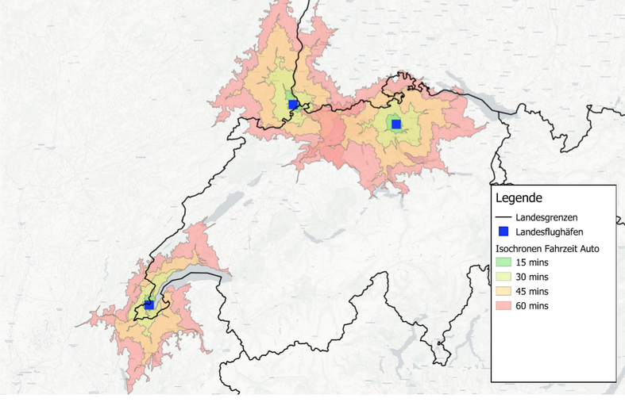
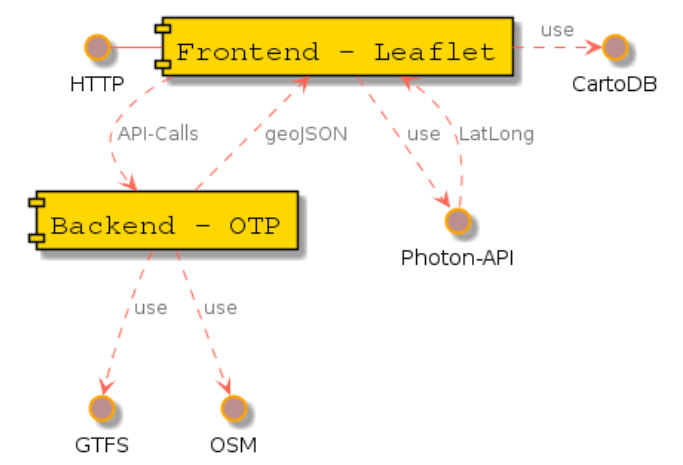
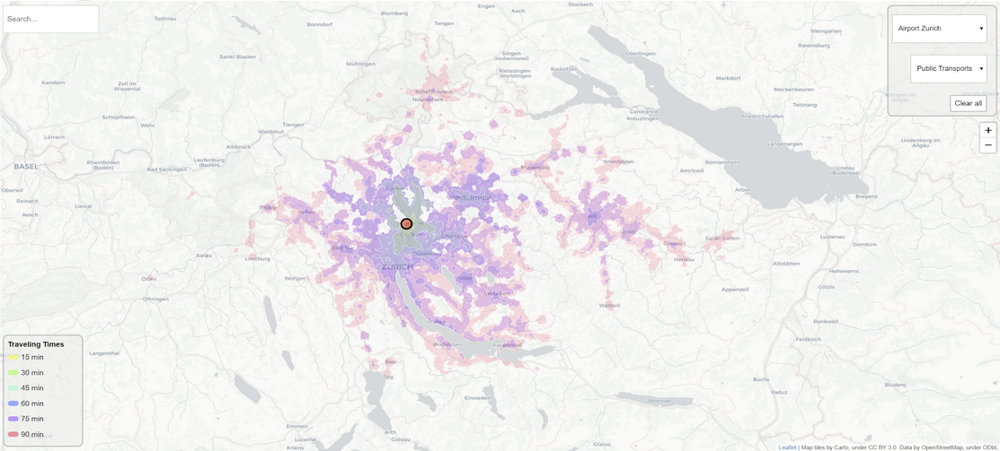

### IsoMap - Isochronenkarte der Schweizer Flughäfen

#### Semesterarbeit im Wahlfach Geoinformationssysteme an der BFH
-----------------------------------------------------------------


##### Marc Christen, Simon Schmid

- [Ziele](#ziele)
  - [Optionale Ziele](#optionale-ziele)
- [Vorgehen](#vorgehen)
  - [QGis - ORS Tools Plugin](#qgis---ors-tools-plugin)
    - [Aufbau](#aufbau)
    - [Verwendete Datenquellen](#verwendete-datenquellen)
    - [Ergebnisse](#ergebnisse)
  - [OTP - OpenTripPlanner](#otp---opentripplanner)
  - [Evaluierung](#evaluierung)
    - [Webapplikation](#webapplikation)
  - [Aufbau](#aufbau-1)
    - [Ergebnisse](#ergebnisse-1)
  - [Quellen](#quellen)
    - [Software](#software)
    - [Daten und Schnittstellen](#daten-und-schnittstellen)
  - [Mögliche Probleme mit GTFS-Daten und OTP](#m%C3%B6gliche-probleme-mit-gtfs-daten-und-otp)
- [Getting started](#getting-started)


# Ziele
- Es sollen mit verschiedenen Instrumenten versucht werden, eine Isochronenenkarte mit den Anfahrtszeiten zu Flughäfen in der Schweiz zu erzeugen. 
- Dafür soll in einem ersten Schritt versucht werden, mit [QGis][qgis] und allenfalls geeigneten Plugins Isochronenkarten mit fixen Zeitintervallen für alle Flughäfen in der Schweiz zu erzeugen.
- In einem weiteren Schritt soll eine Webapplikation zur dynamischen Erzeugung von Isochronen unter Verwendung von Webservices erzeugt werden.

## Optionale Ziele
- Isochronen für eine beliebige Adresse und Zeitintervalle erstellen
- Konfiguration von Parameter via Web-GUI. Beispielsweise Transportmittel: Zu Fuss, Auto, öffentlicher Verkehr, etc.

# Vorgehen
Zu Beginn des Projektes wurden zwei Tools für die Umsetzung der Ziele verglichen. Das Plugin ORS Tools für die Desktop Software QGis und die Open Source Applikation OpenTripPlanner (OTP).

## QGis - ORS Tools Plugin
Die Aufgabe der Isochronenerstellung ist in QGis nicht nativ zu lösen, kann aber mit Plugins recht komfortabel umgesetzt werden. Wir haben das Plugin [ORS Tools Plugin][ors_tools] verwendet.
Eine gute Installationsanleitung ist unter folgendem Link verfügbar: [ORS Tools Help][ORS_Tools_Help].

### Aufbau
Anfangs haben wir als Basemap eine Karte von Openstreetmap verwendet, sind dann zum Schluss aber bei einer farblich etwas dezenteren Karte von CartoDB verblieben. Diese kann gleich wie die Openstreetmap über das Quickmapservices-Plugin als Layer zu QGis hinzugefügt werden.
Da wir keine Geodaten zu den Standorten der Flughäfen der Schweiz gefunden haben, haben wir diese händisch in zwei separaten Vektorlayern erfasst, als Grundlage dienten dazu die in Wikipedia erfasste Koordinatenpunkte der Flugplätze.

### Verwendete Datenquellen
ORS verwendet die API von [OpenRouteService.org][OpenRouteService], die einen entsprechenden Account auf der Plattform voraussetzt.
Damit können die Isochronen-Daten direkt von diesem Service bezogen werden.

### Ergebnisse



## OTP - OpenTripPlanner
OpenTripPlanner (OTP) ist primär ein Open Source Projekt zur Reiseplanung. Mit Hilfe von GTFS- und OpenStreetMap-Daten können Fahrgastinformationen, Verkehrsnetze, etc. analysiert werden. Dadurch können Routen, die Transit-, Fussgänger-, Fahrrad- und Autosegmente über Netzwerke kombinieren und gefunden werden. Die Software läuft auf praktisch jeder Plattform mit einer JVM (Java Virtual Machine). Alle Anfragen werden über eine REST-API behandelt, beispielsweise um die Isochronen für einen bestimmten Punkt (Koordinate) berechnen zu lassen und das Resultat als geoJSON zurückgeben zu können (Beispiel: http://docs.opentripplanner.org/en/latest/Intermediate-Tutorial/).
Projektseite: http://opentripplanner.org

## Evaluierung
Da OTP mehr Funktionen und Parameter zur Erstellung von Isochronenkarten bietet, haben wir uns für dieses Tool entschieden um unsere Ziele zu erreichen. Wir verwenden OTP als Backend-Service und visualisieren die Isochronenkarten in einem Web-Frontend mit Hilfe der JavaScript-Bibliothek Leaflet.

### Webapplikation
## Aufbau

Mit Leaflet wird die etwas hellere Basemap von [CartoDB] eingebunden, damit die Isochronen später besser dargestellt werden. Die Requests auf das OTP-Backend werden mit asynchronen Abfragen (jQuery/AJAX) durchgeführt:
```
 $.ajax({
    url:
      "http://localhost:8080/otp/routers/current/isochrone?" + cutoffSecParam,
    type: "GET",
    dataType: "json",
    data: {
      fromPlace: from.join(","),
      mode: mode,
      maxWalkDistance: 1500
    },
    success: drawIsochrone,
    error: isochroneError
  });
}
```
Als Adresssuche für OpenStreetMap (OSM) wird die API von Photon angesprochen (http://photon.komoot.de/). Hierzu gibt es auch ein praktisches Plugin für Leaflet, welches die Einbindung in unser Projekt vereinfacht.
```
var map = new L.Map("map", {
  scrollWheelZoom: false,
  zoomControl: false,
  photonControl: true,
  photonControlOptions: {
    onSelected: showSearchPoints,
    placeholder: "Search...",
    position: "topleft",
    url: 'https://photon.komoot.de/api/?',
    limit: 5
  },
```

### Ergebnisse


## Quellen
### Software
ORS Tools (QGis Plugin): https://openrouteservice.org/
OpenTripPlanner: http://docs.opentripplanner.org/en/latest/Intermediate-Tutorial/#calculating-travel-time-isochrones
Leaflet: https://leafletjs.com/
Leaflet Plugin Photon: https://github.com/komoot/leaflet.photon
### Daten und Schnittstellen
General Transit Feed Specification Format (GTFS): https://opentransportdata.swiss/en/dataset/timetable-2019-gtfs
https://developers.google.com/transit/gtfs/
Open Street Map
https://www.openstreetmap.org/#map=8/46.825/8.224 
Photon-API: http://photon.komoot.de/

## Mögliche Probleme mit GTFS-Daten und OTP
Um die Scheizer GTFS-Daten mit OTP verwenden zu können, mussten wir eine spezifische Anpassung im Code von OTP selber vornehmen und einen eigenen Build erstellen ([JAR-File](otp-1.4.0-SNAPSHOT-shaded.jar)). Der Grund dafür war, dass bei den GTFS-Daten ein Taxi-Service hinterlegt ist, der OTP nicht interpretieren kann und deshalb beim Erstellen des Graphen abbricht. Es gibt bereits einen Patch, der jedoch noch nicht in die neuste Major-Version von OTP aufgenommen wurde. Der Link für die nötigen Korrekturen: https://github.com/johannilsson/OpenTripPlanner/commit/4f776e79de832b67d1c27d9508588472979bf37c

Zudem kann es vorkommen, dass OTP einige Routen-Typen in den GTFS-Daten nicht richtig interpretieren kann. Für die jeweiligen Typen gibt es Codes, die OTP unter Umständen auch nicht richtig interpretiert und Probleme verursacht. Hier ein Beispiel in der Google-Gruppe von OTP: https://groups.google.com/forum/#!topic/opentripplanner-dev/ZPbmb-a21Qg

# Getting started
Wir verwenden als Backendservice zum berechnen der Isochronen einen lokalen [OpenTripPlanner-Service][opentripplanner]. Dieser verwendet ein Graph-Objekt eines beliebigen Kartenauschnittes um Fahrzeiten zwischen verschiedenen Punkten auf der Karte zu berechnen.
Um den Graphen zu erstellen sind verschiedene Daten erforderlich:
- Geodaten der Schweiz, hierzu wurde ein etwas über die Landesgrenzen hinausgehender Ausschnitt verwendet, welcher von [hier][switzerland_extended_pbf] heruntergeladen werden kann.
- Fahrplandaten, die ebenfalls in den Graphen kompiliert werden. Diese liegen als .zip-File vor, welches [hier][switzerland_gtfs] abgeholte werden kann.
```
mkdir "./graphs/current"
```

Die erwähnten Daten müssen im 'graphs/current' - Ordner des Projektes abgelegt werden, damit sie mit folgendem Befehl gefunden und in den Graphen hineinkompiliert werden können. Dieser Schritt ist sehr Zeit- und Speicherintensiv, muss aber nur einmal gemacht werden.
```
java -Xmx10G -jar otp-1.4.0-SNAPSHOT-shaded.jar --build ./graphs/current
```

Web-Service mit kompiliertem Graph starten:
```
java -Xmx8G -jar otp-1.4.0-SNAPSHOT-shaded.jar --graphs ./graphs --router current --server

20:56:21.233 INFO (OTPServer.java:39) Wiring up and configuring server.
20:56:21.237 INFO (GraphScanner.java:64) Attempting to automatically register routerIds [current]
20:56:21.237 INFO (GraphScanner.java:65) Graph files will be sought in paths relative to .
20:56:21.238 INFO (GraphService.java:176) Registering new router 'current'
20:56:21.239 INFO (InputStreamGraphSource.java:181) Loading graph...
20:56:24.661 INFO (Graph.java:746) Graph version: MavenVersion(1, 4, 0, SNAPSHOT, 35797650dfd0aa43d225b579b7db4ea748de769b)
20:56:24.662 INFO (Graph.java:747) OTP version:   MavenVersion(1, 4, 0, SNAPSHOT, 35797650dfd0aa43d225b579b7db4ea748de769b)
20:56:24.662 INFO (Graph.java:764) This graph was built with the currently running version and commit of OTP.

....
20:58:03.479 INFO (NetworkListener.java:750) Started listener bound to [0.0.0.0:8080]
20:58:03.481 INFO (NetworkListener.java:750) Started listener bound to [0.0.0.0:8081]
20:58:03.484 INFO (HttpServer.java:300) [HttpServer] Started.
20:58:03.484 INFO (GrizzlyServer.java:153) Grizzly server running.
```
Der Web-Server ist dann unter http://localhost:8080/ verfügbar.

[qgis]: https://www.qgis.org/de/site/
[ors_tools]: https://plugins.qgis.org/plugins/ORStools/
[switzerland_extended_pbf]: https://drive.google.com/file/d/11sF108eoYH1Y90dz2mh05JzF1vsw5rkr/view?usp=sharing
[switzerland_gtfs]:https://drive.google.com/file/d/1FaKUMMOI0vpWk9JVY4480sLfDZQXBHQa/view?usp=sharing
[opentripplanner]:https://www.opentripplanner.org/
[OpenRouteService]:https://openrouteservice.org/
[ORS_Tools_Help]:https://github.com/nilsnolde/orstools-qgis-plugin/wiki/ORS-Tools-Help
[CartoDB]:https://carto.com/location-data-services/basemaps/